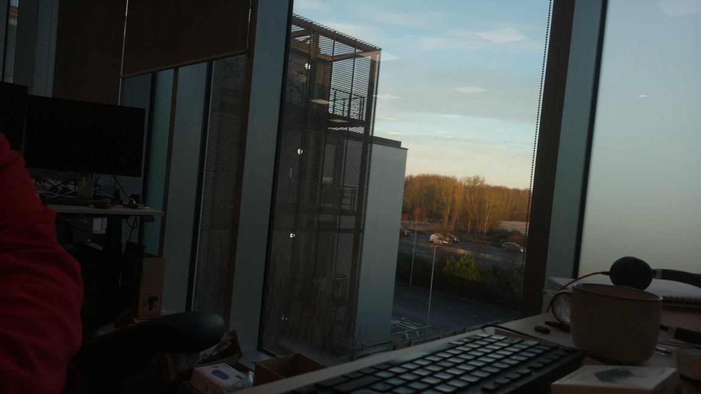
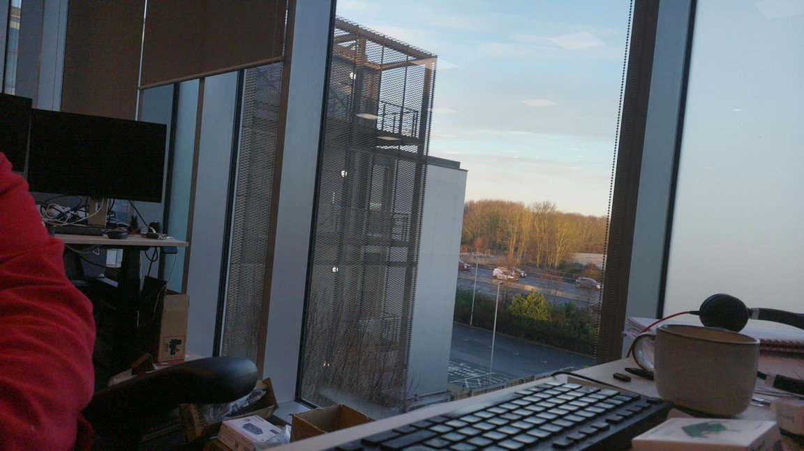
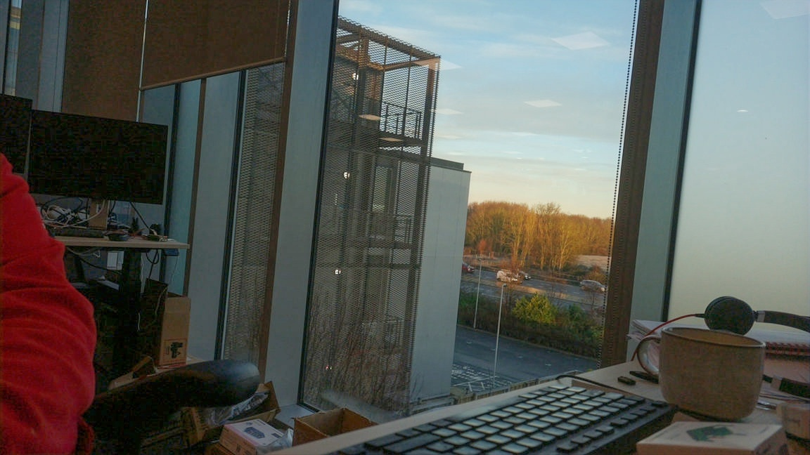

# AI Enhance

Low-light image enhancement using either the Zero-DCE (Zero-Reference Deep Curve Estimation) or the DPRNet (Differentiable Pyramid Representation) algorithm.

## Overview

### Zero-Reference Deep Curve Estimation

Enhances dark or low-light images by learning pixel-wise curve adjustments without requiring paired training data. The algorithm iteratively applies learned enhancement curves to brighten images while preserving natural appearance.

Based on the paper: **"Zero-Reference Deep Curve Estimation for Low-Light Image Enhancement"** by Guo, Li et al. ([arXiv:2001.06826](https://arxiv.org/abs/2001.06826)), though this implementation does add some more explicit control of the target brightness based on the `gain` parameter (see below).

### Differentiable Pyramid Representation

Uses differentiable pyramids and global adjustment to adaptively tonemap input images. Trained on the [HDRI Haven dataset](https://polyhaven.com/hdris). This algorithm tends to affect local contrast and colour more strongly, so the implementation here adds some controls that can slightly tone down the effect of the network.

Based on the paper: **"Learning Differential Pyramid Representation for Tone Mapping"** by Yang, Li et al. ([arXiv:2412.01463](https://arxiv.org/pdf/2412.01463)).

### Examples

| Before | After (Zero-DCE) | After (DPRNet) |
|--------|-------|-------|
|  |  |  |

## Installation

Install the required Python packages:

```bash
pip install numpy opencv-python pillow tqdm ai-edge-litert
```

## Usage

Zero-DCE:

```bash
python enhance_dcenet.py <input_image> <output_image> [options]
```

DPRNet:

```bash
python enhance_dprnet.py <input_image> <output_image> [options]
```

For DPRNet, we recommend supplying PNG instead of JPEG images, as the network can in some circumstances "see" and "enhance" any JPEG encoding artifacts.

### Required Arguments

- `input` - Path to the input image file
- `output` - Path for the output enhanced image

### Optional Arguments (Zero-DCE)

| Argument | Default | Description |
|----------|---------|-------------|
| `--model` | `dcenet.tflite` | Path to the model file. You may want to consider trying the `dcenet_int8.tflite` quantized model |
| `--gain` | `1.0` | Brightness adjustment factor. Higher values produce brighter output |
| `--local-strength` | `0.25` | Balance between local and global brightness (0.0-1.0). Higher values brighten dark areas more |
| `--patch-size` | `256` | Patch size for processing. Use 0 for full image size. Smaller values reduce memory usage |
| `--batch-size` | `1` | Number of patches to process simultaneously |
| `--num-threads` | `4` | Number of CPU threads for inference |
| `--overlap-pixels` | `16` | Pixel overlap between patches to reduce seam artifacts |
| `--hide-progress` | `false` | Hide the progress bar during processing |
| `--quality` | `95` | JPEG output quality (0-100). Higher values produce larger, higher quality files |
| `--compress-level` | `1` | PNG compression level (0-9). Higher values produce smaller files but take longer |

### Optional Arguments (DPRNet)

| Argument | Default | Description |
|----------|---------|-------------|
| `--model` | `DPRNet_1024.tflite` | Path to the model file. You may want to consider trying the `DPRNet_512.tflite` model if you are running out of memory |
| `--gain` | `1.0` | Brightness adjustment factor. Higher values produce brighter output |
| `--local-strength` | `0.5` | Higher values use more of the network output, producing more local contrast and colour adjustment |
| `--num-threads` | `4` | Number of CPU threads for inference |
| `--quality` | `95` | JPEG output quality (0-100). Higher values produce larger, higher quality files |
| `--compress-level` | `1` | PNG compression level (0-9). Higher values produce smaller files but take longer |

DPRNet uses downscaling with a fixed size network instead of tiling, and therefore has no parameters related to batch or patch size.

### Examples

**Zero-DCE**

Basic usage:
```bash
python enhance_dcenet.py dark_photo.jpg enhanced_photo.jpg
```

With increased brightness:
```bash
python enhance_dcenet.py dark_photo.jpg enhanced_photo.jpg --gain 1.3
```

Low memory usage (smaller patches):
```bash
python enhance_dcenet.py large_image.jpg output.jpg --patch-size 128
```

Using the int8 quantised model:
```bash
python enhance_dcenet.py input.jpg output.jpg --model dcenet_int8.tflite
```

**DPRNet**

Basic usage:
```bash
python enhance_dprnet.py dark_photo.png enhanced_photo.jpg
```

Low memory usage (smaller model):
```bash
python enhance_dprnet.py dark_photo.png enhanced_photo.jpg --model DPRNet_512.tflite
```

## Performance

The models don't have to be run on Pis; you can run them on pretty much any computer.

### Zero-DCE

On a Pi 5 the default `dcenet.tflite` model runs at somewhat less than 1 megapixel per second. The quantised `dcenet_int8.tflite` runs very roughly twice as fast, but produces different results (though not conspicuously so).

Performance will obviously be worse on lower specification Pis, and we don't recommend running the models on anything with less than 1GB of memory.

In practice, the `patch-size` and `batch-size` parameters make little difference to the run time, so the defaults should be acceptable for most use cases.

### DPRNet

The DPRNet models execute very quickly because they rely on downscaling input images to match the model size rather than processing in multiple tiles. It runs in a second or two on a Pi 5.

We recommend at least 2GB of memory to run these models. The larger model (`DPRNet_1024.tflite`) may run more slowly on a 2GB device, in which case the smaller model (`DPRNet_512.tflite`) may run better. On 1 GB device, the smaller model should work, though you may need to increase the size of your swapfile to 2GB.

## License

BSD 2-Clause License. See [LICENSE](LICENSE) for details.
